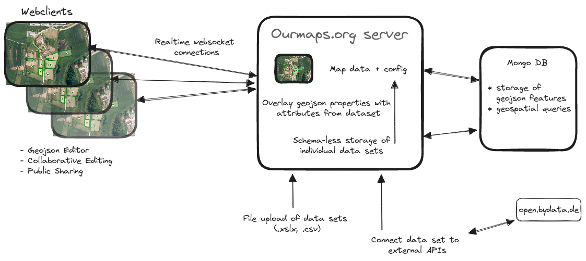

[](https://github.com/digitaltom/mapforge/actions/workflows/ci.yml)
[](https://github.com/digitaltom/mapforge/actions/workflows/docker-publish.yml)
[](https://codeclimate.com/github/digitaltom/mapforge)
[](https://coveralls.io/github/digitaltom/mapforge?branch=main)

# README


https://excalidraw.com/#json=m0CjM7w_E-dtFDKmvQvIf,K07A5jDq8rCCqgmJMkjElw

## Geojson

This app supports and stores data in an extended version of the
[mapbox simplestyle spec](https://github.com/mapbox/simplestyle-spec/tree/master/1.1.0).

Supported attributes so far:

* All geometries: `title`, `desc`
* Point geometry: `marker-color` ('transparent' for none), `stroke`, `stroke-width`, `marker-icon`,
                  `marker-symbol` (supports single digit/character, emoji, line-awesome icon name)
* LineString geometry: `stroke-width`, `stroke`
* Polygon geometry: `stroke-width`, `stroke`, `fill`

## Development Setup

Dependencies:


```
zypper in proj-devel # (libproj-dev) for building rgeo-proj4
zypper in proj # (proj-bin) for running rgeo-proj4
zypper in npm # for running eslint
bundle
```


Run develoment server:

```
rails s
```

* Put map keys (MAPTILER_KEY, MAPBOX_KEY) into `.env.development`
* MongoDB backend is expected at: `ENV.fetch("MONGO_URL") { "localhost:27017" }`
* Redis (for action cable) is expected at: `ENV.fetch("REDIS_URL") { "redis://localhost:6379/1" }`


### Tasks

Import map from .geojson (samples in db/seeds):

`bin/rake seed:from_file['db/seeds/germany_areas.json']`

More .geojson example files at: https://exploratory.io/map


### Tests

Linters:
  * `bin/rubocop`
  * `npm install; npm run lint:css; npm run lint:js`

Fix style with eslint: `npm run fix:js`

Specs: `bundle exec rspec`

### Container build

* Build: `docker build -t mapforge .`
* Run: `docker run -e SECRET_KEY_BASE=e3c9f2... mapforge`

Github builds a new container on each commit to `main`: ghcr.io/digitaltom/mapforge
